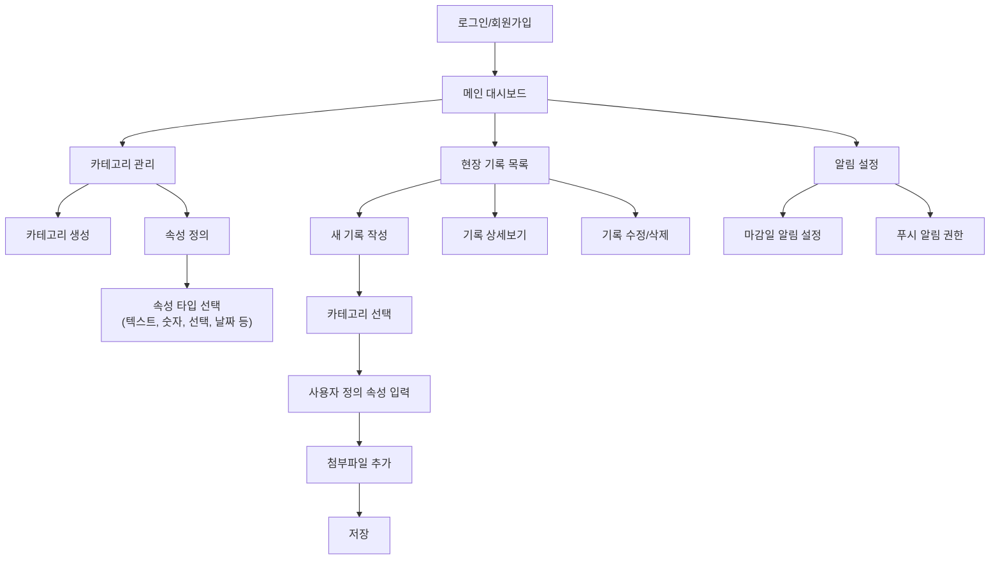

# 📋 현장기록(FieldLog) 앱 기획서

## 1. 프로젝트 개요

### 1.1 앱 개념
- **앱명**: 현장기록 (FieldLog)
- **목적**: 다양한 현장(공사, 서버, 배송, 행사 등)에서 발생하는 할 일과 이슈를 효율적으로 관리
- **핵심 가치**: 사용자 정의 속성을 통한 유연한 데이터 관리

### 1.2 타겟 사용자
- 현장 관리자 및 작업자
- 건설업, IT, 물류, 이벤트 업계 종사자(제한을 두지 안음)
- 체계적인 현장 관리가 필요한 모든 직군

## 2. 핵심 기능 정의

### 2.1 사용자 스토리

#### 🔐 로그인 및 사용자 관리
```
사용자로서, 
- 개인 계정으로 로그인하여 나만의 작업 공간을 가지고 싶다
- 내가 관리하는 현장들을 구분하여 볼 수 있어야 한다
```

#### 📂 카테고리 관리
```
현장 관리자로서,
- 현장 유형에 맞는 카테고리를 생성하고 관리하고 싶다
- 각 카테고리별로 필요한 속성들을 자유롭게 정의하고 싶다
```

#### 📝 현장 정보 기록
```
작업자로서,
- 발견한 이슈나 할 일을 빠르게 기록하고 싶다
- 내가 정의한 속성에 맞춰 상세 정보를 입력하고 싶다
- 사진이나 파일을 첨부하여 증거자료를 남기고 싶다
```

#### ⏰ 알림 관리
```
사용자로서,
- 마감일이 임박한 작업에 대해 미리 알림을 받고 싶다
- 중요한 이슈에 대해 실시간으로 알림을 받고 싶다
```

## 3. 사용자 플로우 및 화면 구성

### 3.1 메인 사용자 플로우



### 3.2 주요 화면 구성

#### 📱 모바일 화면 구성
1. **로그인/회원가입**
2. **메인 대시보드** - 오늘 할 일, 긴급 이슈, 통계
3. **카테고리 관리** - 카테고리 목록, 속성 설정
4. **현장 기록** - 목록, 상세, 작성/수정
5. **설정** - 알림, 프로필, 백업

#### 💻 웹 대시보드 (선택사항)
- 관리자용 통계 및 분석
- 대량 데이터 관리
- 보고서 생성

## 4. 데이터베이스 설계 (PostgreSQL + JSONB)

### 4.1 핵심 테이블 구조

```sql
-- 사용자 테이블
CREATE TABLE users (
    id SERIAL PRIMARY KEY,
    email VARCHAR(255) UNIQUE NOT NULL,
    password_hash VARCHAR(255) NOT NULL,
    name VARCHAR(100) NOT NULL,
    created_at TIMESTAMP DEFAULT NOW(),
    updated_at TIMESTAMP DEFAULT NOW()
);

-- 카테고리 테이블
CREATE TABLE categories (
    id SERIAL PRIMARY KEY,
    user_id INTEGER REFERENCES users(id) ON DELETE CASCADE,
    name VARCHAR(100) NOT NULL,
    description TEXT,
    color VARCHAR(7), -- HEX 색상코드
    icon VARCHAR(50), -- 아이콘 이름
    field_schema JSONB NOT NULL, -- 사용자 정의 속성 스키마
    created_at TIMESTAMP DEFAULT NOW(),
    updated_at TIMESTAMP DEFAULT NOW()
);

-- 현장 기록 테이블 (메인)
CREATE TABLE field_records (
    id SERIAL PRIMARY KEY,
    user_id INTEGER REFERENCES users(id) ON DELETE CASCADE,
    category_id INTEGER REFERENCES categories(id) ON DELETE SET NULL,
    title VARCHAR(255) NOT NULL,
    description TEXT,
    status VARCHAR(50) DEFAULT 'pending', -- pending, in_progress, completed, cancelled
    priority INTEGER DEFAULT 1, -- 1(낮음) ~ 5(높음)
    due_date TIMESTAMP,
    custom_data JSONB, -- 사용자 정의 속성 데이터
    attachments JSONB, -- 첨부파일 정보
    location JSONB, -- GPS 좌표 등 위치 정보
    created_at TIMESTAMP DEFAULT NOW(),
    updated_at TIMESTAMP DEFAULT NOW()
);

-- 알림 설정 테이블
CREATE TABLE notification_settings (
    id SERIAL PRIMARY KEY,
    user_id INTEGER REFERENCES users(id) ON DELETE CASCADE,
    due_date_reminder_hours INTEGER DEFAULT 24, -- 마감일 몇 시간 전 알림
    push_enabled BOOLEAN DEFAULT true,
    email_enabled BOOLEAN DEFAULT false,
    created_at TIMESTAMP DEFAULT NOW(),
    updated_at TIMESTAMP DEFAULT NOW()
);
```

### 4.2 JSONB 활용 예시

#### 카테고리 스키마 예시 (field_schema)
```json
{
  "fields": [
    {
      "key": "building",
      "label": "동",
      "type": "text",
      "required": true,
      "placeholder": "예: 101동"
    },
    {
      "key": "unit",
      "label": "호수",
      "type": "text",
      "required": true,
      "placeholder": "예: 2001호"
    },
    {
      "key": "location",
      "label": "위치",
      "type": "select",
      "required": true,
      "options": ["거실", "주방", "화장실", "침실1", "침실2", "베란다"]
    },
    {
      "key": "defect_type",
      "label": "하자유형",
      "type": "select",
      "required": true,
      "options": ["전기", "배관", "도배", "바닥", "창호", "기타"]
    },
    {
      "key": "assigned_team",
      "label": "이관",
      "type": "select",
      "required": false,
      "options": ["전기팀", "배관팀", "도배팀", "바닥팀", "창호팀"]
    }
  ]
}
```

#### 실제 데이터 예시 (custom_data)
```json
{
  "building": "101동",
  "unit": "2001호",
  "location": "거실",
  "defect_type": "전기",
  "assigned_team": "전기팀",
  "additional_notes": "전기 입선 불량으로 인한 콘센트 작동 불가"
}
```

### 4.3 인덱스 설정
```sql
-- JSONB 검색 성능 향상을 위한 인덱스
CREATE INDEX idx_field_records_custom_data ON field_records USING GIN (custom_data);
CREATE INDEX idx_categories_field_schema ON categories USING GIN (field_schema);
CREATE INDEX idx_field_records_status ON field_records (status);
CREATE INDEX idx_field_records_due_date ON field_records (due_date);
CREATE INDEX idx_field_records_user_category ON field_records (user_id, category_id);
```

## 5. API 명세서

### 5.1 인증 관련 API

```
POST /api/auth/register
POST /api/auth/login
POST /api/auth/logout
POST /api/auth/refresh
GET  /api/auth/me
```

### 5.2 카테고리 관리 API

```
GET    /api/categories          # 사용자의 카테고리 목록
POST   /api/categories          # 새 카테고리 생성
GET    /api/categories/:id      # 카테고리 상세 조회
PUT    /api/categories/:id      # 카테고리 수정
DELETE /api/categories/:id      # 카테고리 삭제
```

#### 카테고리 생성 예시
```json
POST /api/categories
{
  "name": "건설현장 하자관리",
  "description": "아파트 건설현장 하자 관리용",
  "color": "#FF6B6B",
  "icon": "construction",
  "field_schema": {
    "fields": [
      {
        "key": "building",
        "label": "동",
        "type": "text",
        "required": true
      },
      {
        "key": "unit",
        "label": "호수", 
        "type": "text",
        "required": true
      }
    ]
  }
}
```

### 5.3 현장 기록 관리 API

```
GET    /api/records             # 기록 목록 (필터링, 페이징 지원)
POST   /api/records             # 새 기록 생성
GET    /api/records/:id         # 기록 상세 조회
PUT    /api/records/:id         # 기록 수정
DELETE /api/records/:id         # 기록 삭제
```

#### 기록 생성 예시
```json
POST /api/records
{
  "category_id": 1,
  "title": "101동 2001호 전기 하자",
  "description": "거실 콘센트 작동 불가",
  "status": "pending",
  "priority": 3,
  "due_date": "2024-01-15T09:00:00Z",
  "custom_data": {
    "building": "101동",
    "unit": "2001호",
    "location": "거실",
    "defect_type": "전기",
    "assigned_team": "전기팀"
  },
  "attachments": [
    {
      "type": "image",
      "url": "/uploads/defect_photo_001.jpg",
      "name": "하자사진1.jpg"
    }
  ]
}
```

### 5.4 검색 및 필터링 API

```
GET /api/records/search?q=전기&category=1&status=pending&due_date_from=2024-01-01
```

### 5.5 알림 관리 API

```
GET  /api/notifications/settings    # 알림 설정 조회
PUT  /api/notifications/settings    # 알림 설정 수정
GET  /api/notifications/upcoming    # 다가오는 마감일 목록
```

## 6. 주요 화면 와이어프레임

### 6.1 메인 대시보드
```
┌─────────────────────────────────┐
│ 🏗️ 현장기록                      │
│                         ⚙️ 설정  │
├─────────────────────────────────┤
│ 📊 오늘의 현황                   │
│ • 진행중: 5건                   │
│ • 완료: 12건                    │
│ • 긴급: 2건                     │
├─────────────────────────────────┤
│ ⚠️ 마감 임박 (24시간 이내)        │
│ 🔴 101동 전기하자 (D-1)          │
│ 🟡 서버점검 (D-1)               │
├─────────────────────────────────┤
│ 📝 최근 기록                     │
│ • 배송지연 이슈 (30분 전)        │
│ • 안전점검 완료 (1시간 전)       │
└─────────────────────────────────┘
│ 🏠 홈  📂 기록  📋 카테고리  👤 내정보 │
```

### 6.2 카테고리 관리 화면
```
┌─────────────────────────────────┐
│ ← 카테고리 관리            ➕ 추가 │
├─────────────────────────────────┤
│ 🏗️ 건설현장 하자관리              │
│    5개 속성 • 23개 기록          │
│                         ⚙️ 편집  │
├─────────────────────────────────┤
│ 💻 서버 점검                     │
│    3개 속성 • 8개 기록           │
│                         ⚙️ 편집  │
├─────────────────────────────────┤
│ 🚚 배송 관리                     │
│    4개 속성 • 15개 기록          │
│                         ⚙️ 편집  │
└─────────────────────────────────┘
```

### 6.3 기록 작성 화면
```
┌─────────────────────────────────┐
│ ← 새 기록 작성            💾 저장 │
├─────────────────────────────────┤
│ 카테고리: [건설현장 하자관리 ▼]   │
│                                │
│ 제목: ________________________  │
│                                │
│ 설명: ________________________  │
│      ________________________  │
│                                │
│ 우선순위: [보통 ▼]              │
│ 마감일: [2024-01-15 ▼]         │
│                                │
│ === 사용자 정의 속성 ===         │
│ 동: ___________________________  │
│ 호수: _________________________  │
│ 위치: [거실 ▼]                  │
│ 하자유형: [전기 ▼]              │
│ 이관: [전기팀 ▼]                │
│                                │
│ 📎 첨부파일: [파일 선택]         │
└─────────────────────────────────┘
```

## 7. 기술 스택 추천

### 7.1 백엔드
- **언어**: Node.js (TypeScript)
- **데이터베이스**: PostgreSQL 15+ (JSONB 지원)
- **ORM**: Prisma (Node.js)
- **인증**: JWT + Refresh Token
- **파일 저장**: 우선은 로컬 스토리지, 추 후 변경 예정
- **알림**: Firebase Cloud Messaging (FCM)

### 7.2 프론트엔드
- **모바일**: React Native
- **웹 (선택)**: React + TypeScript
- **상태관리**: Redux Toolkit 또는 Zustand
- **UI 라이브러리**: Tamagui

### 7.3 인프라
- **배포**: Docker(홈서버)
- **모니터링**: 무료버전으로 선택
- **로그**: 무료버전으로 선택

## 8. 개발 우선순위 및 로드맵

### 8.1 MVP (1-2개월)
1. ✅ 사용자 인증 (로그인/회원가입)
2. ✅ 기본 카테고리 CRUD
3. ✅ 간단한 속성 정의 (텍스트, 선택형)
4. ✅ 기록 CRUD (제목, 설명, 상태, 커스텀 데이터)
5. ✅ 기본 목록 및 검색

### 8.2 Phase 2 (2-3개월)
1. 📱 모바일 앱 개발
2. 📎 파일 첨부 기능
3. ⏰ 마감일 알림
4. 🎨 UI/UX 개선
5. 📊 기본 통계 대시보드

### 8.3 Phase 3 (3-4개월)
1. 📍 위치 기반 서비스
2. 👥 팀 협업 기능
3. 📈 고급 분석 및 리포팅
4. 🔄 오프라인 동기화
5. 🔔 실시간 알림

## 9. 예상 개발 비용 및 일정

### 9.1 개발 리소스
- **백엔드 개발자**: 1명 (3-4개월)
- **프론트엔드 개발자**: 1명 (3-4개월)
- **UI/UX 디자이너**: 0.5명 (1-2개월)
- **QA 테스터**: 0.5명 (1개월)

### 9.2 월별 예산 (대략적)
- **개발**: 월 800-1200만원
- **인프라**: 월 10-30만원
- **디자인**: 월 200-400만원

## 10. 성공 지표 (KPI)

### 10.1 사용자 지표
- 월간 활성 사용자 (MAU)
- 일일 기록 생성 수
- 사용자 유지율 (Retention Rate)

### 10.2 기능 지표
- 카테고리당 평균 속성 수
- 기록 완료율
- 알림 응답률

---

## 📝 추가 고려사항

### 보안
- 사용자 데이터 암호화
- API 요청 제한 (Rate Limiting)
- 파일 업로드 보안 검증

### 성능
- JSONB 인덱싱 최적화
- 이미지 압축 및 CDN 활용
- 페이징 및 무한 스크롤

### 확장성
- 마이크로서비스 아키텍처 고려
- 캐싱 전략 (Redis)
- 로드 밸런싱

---

이 기획서를 바탕으로 현장기록 앱을 체계적으로 개발할 수 있습니다. JSONB를 활용한 유연한 데이터 구조로 다양한 현장의 요구사항을 만족시킬 수 있을 것입니다.

**작성일**: 2025년 9월 6일
**버전**: 1.0
**작성자**: AI Assistant
